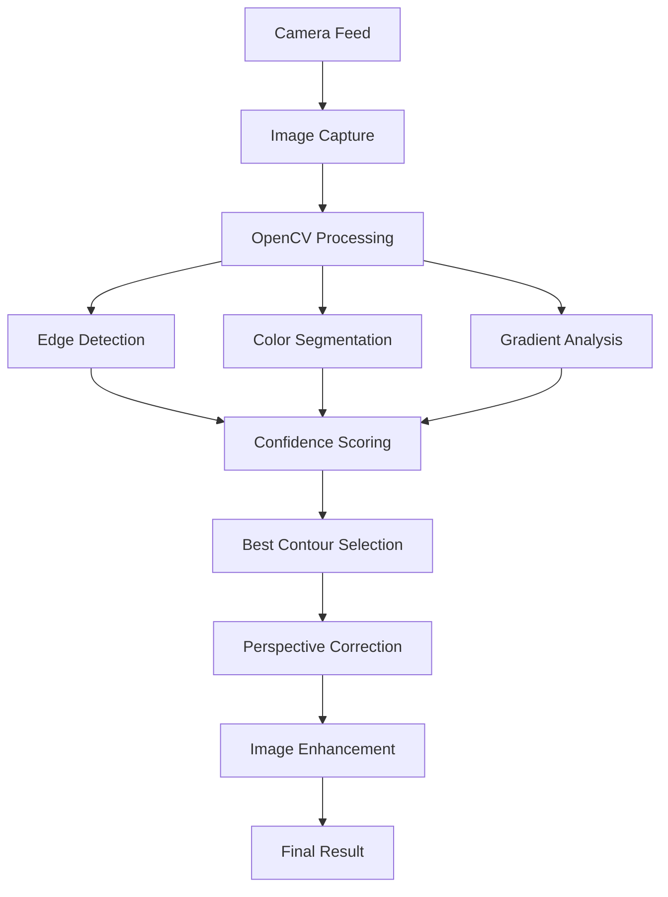

# Document Capture SDK

A production-ready, mobile-first document scanning solution with advanced computer vision capabilities. Built with OpenCV.js and optimized for Brazilian Portuguese users.


## 🚀 Features

### Advanced Computer Vision
- **Multi-Method Document Detection**: Combines three complementary detection approaches:
  - Enhanced edge detection with CLAHE and bilateral filtering
  - Color-based segmentation using HSV/LAB color spaces
  - Gradient-based detection with Sobel operators
- **Confidence Scoring**: Intelligently combines results from all detection methods
- **Robust Perspective Correction**: Handles irregular contours and skewed documents
- **Automatic Image Enhancement**: Contrast and brightness optimization

### Mobile-Optimized Experience
- **Tap-to-Focus**: Touch the video to focus on specific areas
- **Continuous Autofocus**: Automatic focus adjustment for sharp captures
- **Responsive Design**: Works seamlessly across different screen sizes
- **Touch-Friendly Interface**: Optimized for mobile interaction patterns

### Document Workflow
- **Two-Step Capture**: Front and back document scanning
- **Confirmation Modal**: Preview captured images before proceeding
- **Visual Feedback**: Clear status indicators and progress tracking
- **Error Handling**: Graceful degradation with user-friendly messages

### Technical Excellence
- **Memory Management**: Proper OpenCV matrix cleanup prevents memory leaks
- **Fallback Detection**: Works without OpenCV.js for basic functionality
- **Performance Optimized**: Production-ready with debug code removed
- **Cross-Browser Compatible**: Modern browser support with proper polyfills

## 📋 Requirements

- Modern web browser with camera access
- HTTPS connection (required for camera API)
- Minimum 2GB RAM for optimal OpenCV.js performance
- Camera with autofocus capability (recommended)

## 🛠 Installation

### Quick Start

1. Clone the repository:
```bash
git clone https://github.com/your-username/document-capture-sdk.git
cd document-capture-sdk
```

2. Serve the files using a local web server:
```bash
# Using Python
python -m http.server 8000

# Using Node.js
npx serve .

# Using PHP
php -S localhost:8000
```

3. Open your browser and navigate to `https://localhost:8000`

### Production Deployment

Ensure all files are served over HTTPS for camera access:

```
document-capture-sdk/
├── index.html
├── document-capture-sdk.js
├── main.js
├── style.css
└── assets/
    ├── front_status.png
    ├── back_status.png
    └── Capture button.png
```

## 📖 Usage

### Basic Implementation

```html
<!DOCTYPE html>
<html>
<head>
    <script src="https://docs.opencv.org/4.8.0/opencv.js"></script>
    <script src="document-capture-sdk.js"></script>
</head>
<body>
    <video id="cameraVideo" autoplay playsinline muted></video>
    
    <script>
        const documentCapture = new DocumentCapture({
            container: '#cameraVideo',
            onCapture: (result) => {
                console.log('Document captured:', result);
                // Handle the captured document
                displayImage(result.processedImage);
            },
            onError: (error) => {
                console.error('Capture error:', error);
            },
            enableDocumentDetection: true,
            enhanceImage: true
        });
        
        // Start the camera
        documentCapture.startCamera();
    </script>
</body>
</html>
```

### Advanced Configuration

```javascript
const documentCapture = new DocumentCapture({
    container: '#cameraVideo',
    width: 1920,
    height: 1080,
    enableDocumentDetection: true,
    enhanceImage: true,
    onCapture: (result) => {
        // Access different image versions
        const originalImage = result.originalImage;
        const processedImage = result.processedImage;
        const metadata = result.metadata;
        
        // Check detection success
        if (metadata.hasDocumentDetection) {
            console.log('Document detected successfully');
        }
        
        // Access document bounds
        if (result.documentBounds) {
            const { x, y, width, height } = result.documentBounds;
            console.log(`Document found at: ${x},${y} (${width}x${height})`);
        }
    },
    onStatusChange: (message, type) => {
        updateStatusDisplay(message, type);
    },
    onError: (error) => {
        handleError(error);
    }
});
```

## 🏗 Architecture

### Core Components

1. **DocumentCapture Class** (`document-capture-sdk.js`)
   - Main SDK with computer vision algorithms
   - Camera management and image processing
   - Multi-method document detection engine

2. **Application Logic** (`main.js`)
   - Two-step capture workflow
   - UI state management
   - Modal confirmation system

3. **User Interface** (`index.html` + `style.css`)
   - Mobile-first responsive design
   - Portuguese localization
   - Modern, accessible components

### Detection Pipeline



## 🎯 API Reference

### DocumentCapture Constructor

```javascript
new DocumentCapture(options)
```

#### Options

| Property | Type | Default | Description |
|----------|------|---------|-------------|
| `container` | string | `'#cameraVideo'` | CSS selector for video element |
| `width` | number | `1280` | Preferred camera width |
| `height` | number | `720` | Preferred camera height |
| `enableDocumentDetection` | boolean | `true` | Enable OpenCV document detection |
| `enhanceImage` | boolean | `false` | Apply image enhancement |
| `onCapture` | function | `null` | Callback for successful capture |
| `onError` | function | `null` | Error handling callback |
| `onStatusChange` | function | `null` | Status update callback |

#### Methods

| Method | Description | Returns |
|--------|-------------|---------|
| `startCamera()` | Initialize camera stream | `Promise<boolean>` |
| `captureDocument()` | Capture and process document | `Promise<CaptureResult>` |
| `destroy()` | Clean up resources | `void` |

#### CaptureResult Object

```javascript
{
    originalImage: string,        // Base64 original image
    processedImage: string,       // Base64 processed image
    documentBounds: {             // Detected document bounds
        x: number,
        y: number,
        width: number,
        height: number
    },
    perspectiveTransform: {       // Transformation matrix
        matrix: number[],
        outputWidth: number,
        outputHeight: number,
        sourcePoints: Point[]
    },
    timestamp: string,            // ISO timestamp
    metadata: {
        width: number,
        height: number,
        hasDocumentDetection: boolean,
        hasPerspectiveCorrection: boolean,
        detectionMethod: string
    }
}
```

## 🌐 Browser Support

| Browser | Version | Status |
|---------|---------|--------|
| Chrome | 63+ | ✅ Full Support |
| Firefox | 68+ | ✅ Full Support |
| Safari | 11+ | ✅ Full Support |
| Edge | 79+ | ✅ Full Support |
| Mobile Chrome | 63+ | ✅ Full Support |
| Mobile Safari | 11+ | ✅ Full Support |

## 🔧 Development

### Setup Development Environment

```bash
# Clone repository
git clone https://github.com/your-username/document-capture-sdk.git
cd document-capture-sdk

# Install development dependencies
npm install

# Start development server
npm run dev
```

### Building for Production

```bash
# Minify and optimize
npm run build

# Test production build
npm run serve:prod
```

### Testing

```bash
# Run test suite
npm test

# Run specific tests
npm test -- --grep "document detection"
```

## 📱 Mobile Optimization

### Camera Constraints

The SDK automatically applies optimal camera settings:

```javascript
{
    video: {
        facingMode: 'environment',      // Use back camera
        focusMode: 'continuous',        // Continuous autofocus
        exposureMode: 'continuous',     // Auto exposure
        whiteBalanceMode: 'continuous'  // Auto white balance
    }
}
```

### Performance Tips

- **Memory Management**: OpenCV matrices are properly cleaned up
- **Image Sizing**: Automatic resolution optimization for device capabilities
- **Fallback Detection**: Graceful degradation when OpenCV is unavailable
- **Touch Optimization**: Tap-to-focus for better mobile experience

## 🌍 Internationalization

Currently supports:
- **Portuguese (Brazil)** - Primary language
- **English** - Development/technical documentation

To add more languages, modify the status messages in `main.js`.

## 🤝 Contributing

1. Fork the repository
2. Create a feature branch (`git checkout -b feature/amazing-feature`)
3. Commit your changes (`git commit -m 'Add amazing feature'`)
4. Push to the branch (`git push origin feature/amazing-feature`)
5. Open a Pull Request

### Code Style

- Use ES6+ features
- Follow JSDoc commenting standards
- Maintain mobile-first responsive design
- Ensure proper memory cleanup for OpenCV operations

## 📄 License

This project is licensed under the MIT License - see the [LICENSE](LICENSE) file for details.

## 🙏 Acknowledgments

- [OpenCV.js](https://docs.opencv.org/4.x/d5/d10/tutorial_js_root.html) for computer vision capabilities
- [MediaDevices API](https://developer.mozilla.org/en-US/docs/Web/API/MediaDevices) for camera access
- Modern browser vendors for WebRTC support

## 📞 Support

For support, email fishermorgan61@gmail.com or open an issue on GitHub.

## 🔗 Related Projects

- [OpenCV.js Documentation](https://docs.opencv.org/4.x/d5/d10/tutorial_js_root.html)
- [WebRTC Samples](https://webrtc.github.io/samples/)
- [Camera API Best Practices](https://developer.mozilla.org/en-US/docs/Web/API/MediaDevices/getUserMedia)

---

Made with ❤️ for document digitization